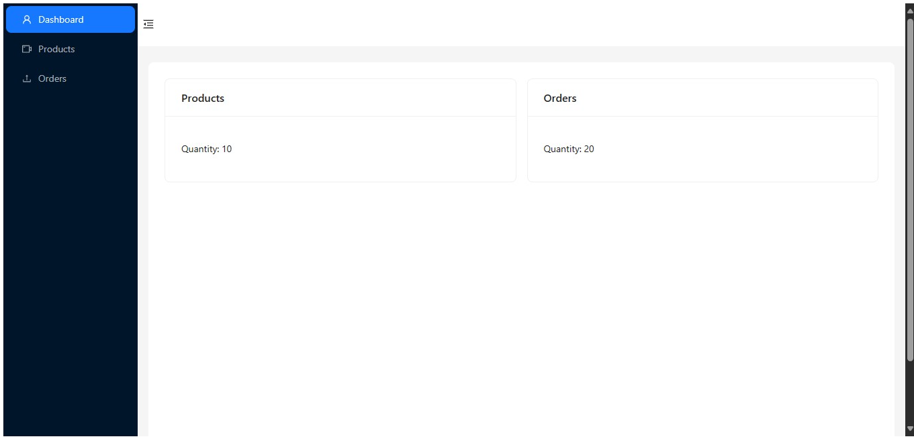
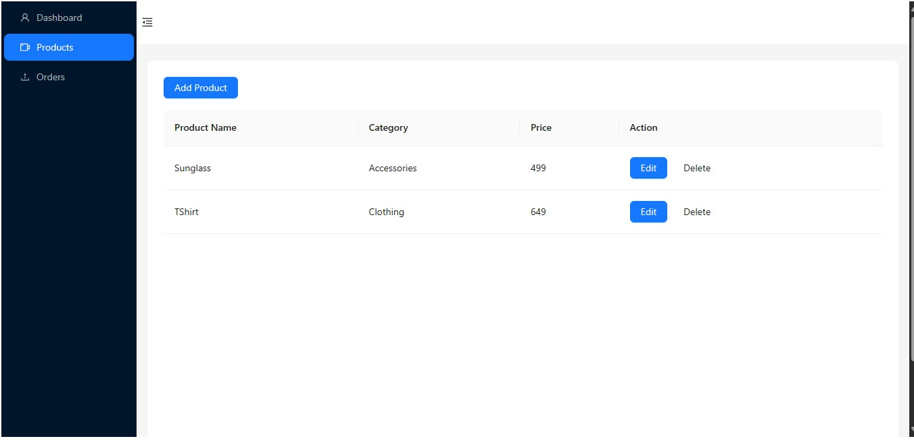
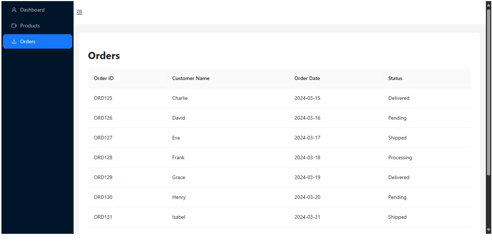

# Getting Started with Create React App

Before running the application, ensure you have the following software installed on your machine:

-Node.js
-npm (Node Package Manager)

## Installation

Clone this repository to your local machine using the following command:

### `git clone https://github.com/Sivaprasad47/erpsystem.git`

Navigate to the project directory:

### `cd erpsystem`

Install dependencies using npm

### `npm install`

## Usage

Running the Application

To run the front-end application, follow these steps:

Start the development server:

### `npm start`

Open your web browser and navigate to http://localhost:3000 to view the website.

## Using the Website
Dashboard: The dashboard provides an overview of key metrics and features of the ERP system.

Products Management: In the Products management page, you can view a list of products with details such as name, category, price, and stock quantity. You can add, edit, and delete products using the respective functionalities.

Orders Management: The Orders management page displays a list of orders with details like order ID, customer name, order date, and status.

## Screenshots

Dashboard - Provides an overview of key metrics and features.

Products Management - Allows for the management of product listings.

Orders Management - Facilitates viewing and handling orders.

"# erpsystem" 
"# erpsystem" 
